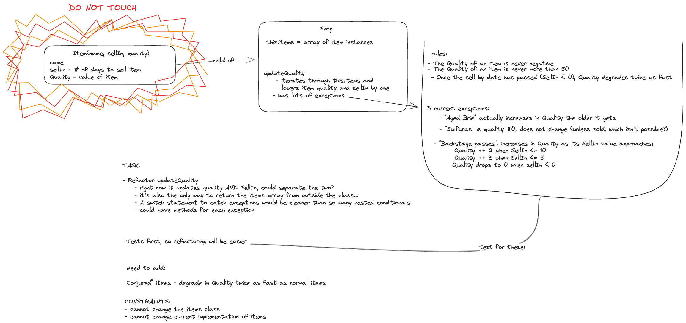
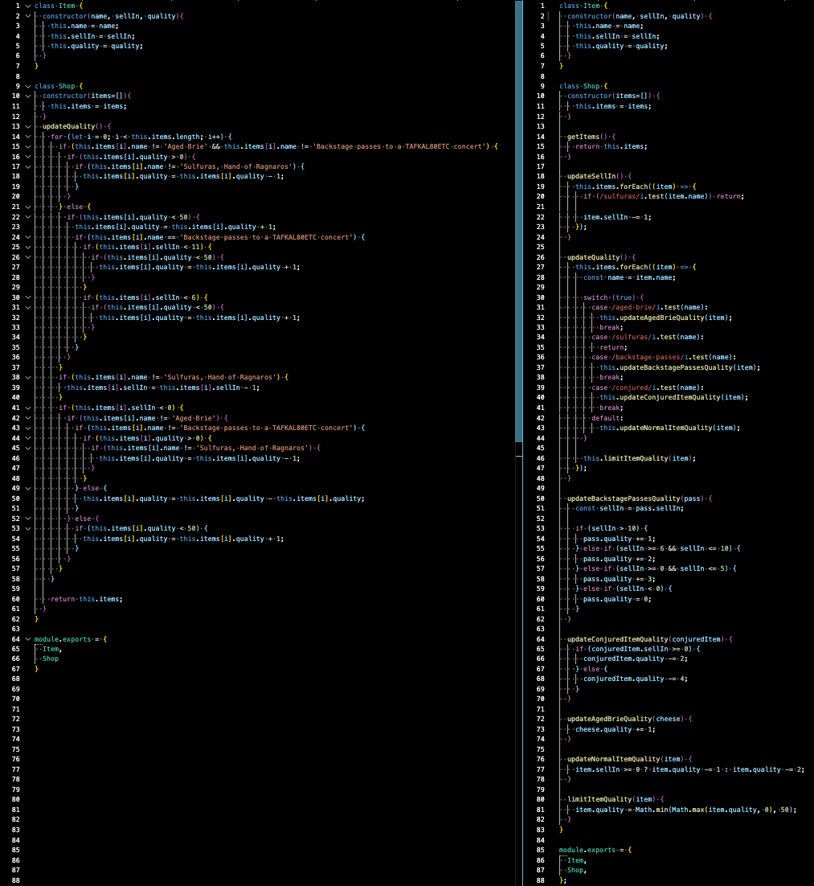
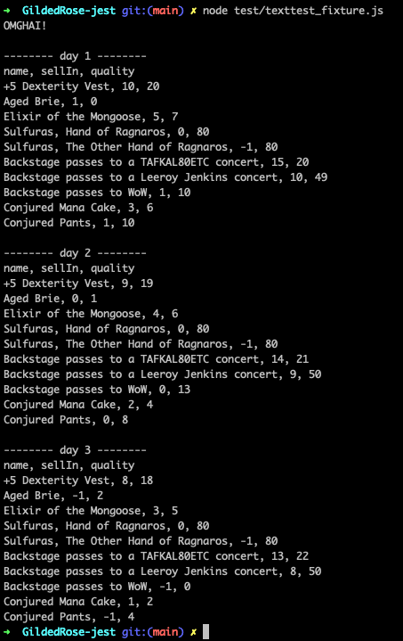

# Gilded Rose

This is my attempt at the Gilded Rose kata in JavaScript with Jest. The starting point for this kata is copied from: https://github.com/emilybache/GildedRose-Refactoring-Kata

## Specification

Hi and welcome to team Gilded Rose. As you know, we are a small inn with a prime location in a
prominent city ran by a friendly innkeeper named Allison. We also buy and sell only the finest goods.
Unfortunately, our goods are constantly degrading in quality as they approach their sell by date. We
have a system in place that updates our inventory for us. It was developed by a no-nonsense type named
Leeroy, who has moved on to new adventures. Your task is to add the new feature to our system so that
we can begin selling a new category of items. First an introduction to our system:

	- All items have a SellIn value which denotes the number of days we have to sell the item
	- All items have a Quality value which denotes how valuable the item is
	- At the end of each day our system lowers both values for every item

Pretty simple, right? Well this is where it gets interesting:

	- Once the sell by date has passed, Quality degrades twice as fast
	- The Quality of an item is never negative
	- "Aged Brie" actually increases in Quality the older it gets
	- The Quality of an item is never more than 50
	- "Sulfuras", being a legendary item, never has to be sold or decreases in Quality
	- "Backstage passes", like aged brie, increases in Quality as its SellIn value approaches;
	Quality increases by 2 when there are 10 days or less and by 3 when there are 5 days or less but
	Quality drops to 0 after the concert

We have recently signed a supplier of conjured items. This requires an update to our system:

	- "Conjured" items degrade in Quality twice as fast as normal items

Feel free to make any changes to the UpdateQuality method and add any new code as long as everything
still works correctly. However, do not alter the Item class or Items property as those belong to the
goblin in the corner who will insta-rage and one-shot you as he doesn't believe in shared code
ownership (you can make the UpdateQuality method and Items property static if you like, we'll cover
for you).

Just for clarification, an item can never have its Quality increase above 50, however "Sulfuras" is a
legendary item and as such its Quality is 80 and it never alters.


## Approach

This kata is meant to train your ability to understand and improve legacy code. This was my approach:

- I started by extracting relevant details from the brief above, diagramming the existing classes, and playing with the codebase to understand how it worked. I made sure to note the task clearly, list any constraints, and jot down ideas for refactoring. 
_________________

_________________
- Then, I wrote behavior tests for all the existing items. I chose not to mock the Item class, because I didn't want to get killed by the goblin, and I figured no one else would either so it wasn't going to change any time soon. I did add a getItems method to make testing more readable.
- With my tests in place, I started refactoring updateQuality:
  - I separated the logic for updating sellIn into its own method.
  - I wrote a switch statement to replace the nested if statements.
  - I extracted the logic for each special item into their own methods then refactored each one.
- When I was happy with the refactor, I continued using TDD to implement conjured items.
- During the implementation, I made a few more refactoring changes to updateQuality:
  - I changed the switch statement to match item names with regex expressions for flexibility
  - I moved the min/max quality constraints to happen after the switch statement, rather than having them in multiple places.

### Reasoning

By separating out logic into different methods, I tried to adhere to the Single Responsibility Principle (SRP) and give each method a single purpose. UpdateQuality is now basically an index of quality update methods for all items. If an item's quality can change, then that logic is encapsulated in its own method. The sellIn update is now in its own method as well, and can be easily edited in the same manner as updateQuality if there are future items which break the rules for their sellIn property. Because of these changes, I think it's much easier now to add or modify an item or item type than it was before.

## Code Comparison

Here is a side-by-side image of the legacy code from gilded_rose.js ,with my updated code on the right.
_________________

_________________

## Observations

- Writing tests first made refactoring much easier! It let me know if I had broken anything when I made changes, and it also helped me understand how the code worked. For example:
  - The description of Sulfuras in the brief is confusing ( "Sulfuras", being a legendary item, never has to be sold or decreases in Quality'), and I wasn't sure how to handle it. But by testing, and looking at the code, I found that neither its quality nor its sellIn property decrease so I kept that in my refactor.
  - I also found the program had a bug - Aged Brie's quality increase was being doubled when its sell by date passed, despite the rules saying that quality only 'degrades' twice as fast after the date passes, not improves. I changed this in my refactor.
  - I also could not understand what a sellIn value of 0 meant - to me, sell in 0 days means an item is expired, but by testing the code, I found that it's treated as the last possible day to sell (e.g. backstage passes are still valuable even if there sellIn value is 0). I would have renamed it to sellBy, but again, I'm afraid of the goblin.

- If I were to take this further, I would consider changing the class structure, because, right now, Shop is doing a lot of work. I might add a class called ItemUpdater that handled all the property changes. Or, if I could change the Item class, I would make it have subclasses for each 'special' case, with their own methods for updating quality and/or sellIn as necessary. Then again, I would also put it in its own file, but as I've said before, that goblin's no joke.

## Example of Programm Running



## How to Install

In your preferred directory:

```zsh
git clone https://github.com/awdem/GildedRose-kata-js-jest
npm install
```

## How to test

To run all tests:

```zsh
jest
```

To generate test coverage report:

```zsh
jest --coverage
```

## How to run

You can see an example shop-front by copying these commands to your CL:

```zsh
# this defaults to showing 3 days of shop prices:

node test/texttest_fixture.js
```
```zsh
# to show more or less days you can add a number after the file like so:

node test/texttest_fixture.js 4

# You can also have a go at adding your own items to the texttest_fixture file by opening it in the editor of your choice.
```